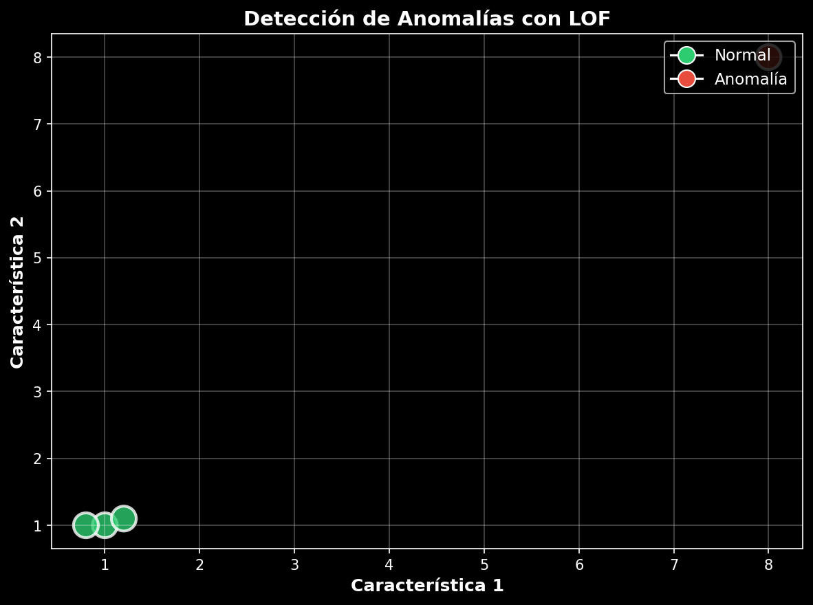
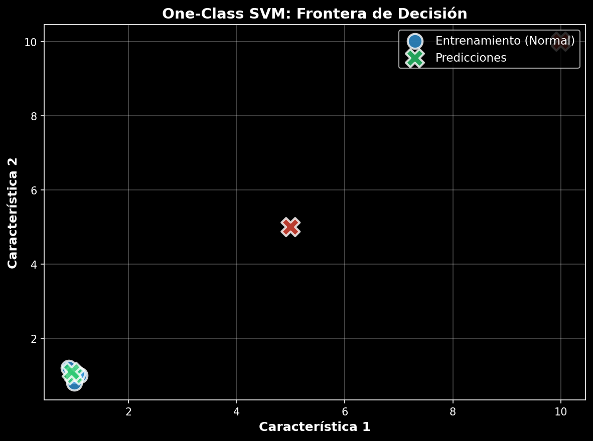
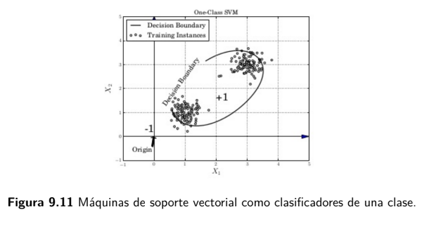

## 1. Introducción {auto-animate="true"}

::: {.incremental}
- **¿Qué son las anomalías?** Valores atípicos que se desvían del comportamiento esperado.
- **¿Por qué importan?** Sistema automatizado de alerta temprana
  - **Ciberseguridad:** Fraudes bancarios e intrusiones
  - **Mantenimiento Predictivo:** Evitar fallos costosos
  - **Salud:** Anomalías en imágenes médicas
  - **Calidad de Datos:** Filtrado de ruido
:::

---

## Aplicaciones Reales

:::: {.columns}

::: {.column width="50%"}
### Finanzas
- Fraude bancario
- Transacciones sospechosas
- Lavado de dinero
:::

::: {.column width="50%"}
### Seguridad
- Intrusiones en redes
- Comportamiento anómalo de usuarios
- Actividades maliciosas
:::

::::

:::: {.columns}

::: {.column width="50%"}
### Medicina
- Detección de picos de enfermedades
- Monitoreo de propagación 
- Detección de Imágenes
:::

::: {.column width="50%"}
### Calidad de Datos
- Detección de datos erróneos
- Ruido en los datos
- Monitoreo de los datos
:::

::::

---

## LOF: Local Outlier Factor {auto-animate="true"}

**Idea Principal:** Densidad local significativamente menor que vecinos

```python
anomalia = densidad_vecinos >> densidad_punto
```

::: {.columns}

::: {.column width="50%"}
**Ventajas**
- Anomalías locales
- Interpretable
- Clusters irregulares
:::

::: {.column width="50%"}
**Desventajas**
- Complejidad O(n²)
- Sensible al parámetro k
- Difícil en tiempo real
:::

:::

---

## LOF: Funcionamiento {auto-animate="true"}

**Paso 1: k-Nearest Neighbors** - Encontrar los k puntos más cercanos.

**Paso 2: Reachability Distance**
$$\text{reach-dist}_k(x, y) = \max\{k\text{-distance}(y), d(x, y)\}$$

**Paso 3: LOF (Local Outlier Factor)**
$$\text{LOF}_k(x) = \frac{\text{densidad vecinos}}{\text{densidad del punto}}$$

---

## LOF: Interpretación del Score {auto-animate="true"}

| Valor | Significado |
|---|---|
| LOF ≈ 1 | Normal |
| LOF > 1 | Sospechoso |
| LOF >> 1 | Anomalía fuerte |

---

## One-Class SVM {auto-animate="true"}

**Idea Principal:** Entrenar con datos normales, aprender una frontera compacta

::: {.columns}

::: {.column width="50%"}
**Ventajas**
- Frontera flexible
- Bueno en altas dimensiones
:::

::: {.column width="50%"}
**Desventajas**
- Requiere sintonización
- Menos interpretable
:::

:::

---

## One-Class SVM: El Hiperplano {auto-animate="true" .smaller}

::: {.fragment}

**Aprendizaje No Supervisado** - Comportamiento de una clase normal

**Función Objetivo**
$$\min_{w,b,\xi} \frac{1}{2}\|w\|^2 + \frac{1}{\nu n}\sum_{i=1}^{n}\xi_i - b$$

:::

::: {.fragment}

**Parámetro $\nu$**
- $\nu = 0.1$: 10% anomalías permitidas
- $\nu = 0.05$: 5% anomalías permitidas
- Valores pequeños → frontera conservadora

:::

---

## Comparación: LOF vs One-Class SVM

| Aspecto | LOF | One-Class SVM |
|---|---|---|
| Tipo | Densidad local | Frontera |
| Parámetro principal | k | ν |
| Anomalías locales | Excelente | Regular |
| Anomalías globales | Regular | Mejor |
| Escalabilidad | Media | Alta |

---

## Implementación: LOF

{width="80%" fig-align="center"}

**Código:** El modelo identifica puntos con baja densidad local como anomalías

---

## Implementación: One-Class SVM

{width="80%" fig-align="center"}

**Resultado:** El modelo aprende una frontera compacta alrededor de los datos normales (azul) y clasifica nuevos puntos como normales (verde) o anomalías (rojo)

::: {.fragment}

**Paso a paso:** Entrenar → Frontera → Evaluar

:::

---

## Implementación: One-Class SVM

{width="80%" fig-align="center"}

---

## Caso Práctico: Fraude Bancario {auto-animate="true"}

::::: {.columns}
::: {.column width="100%"}

**Flujo de Análisis:**

- **Paso 1:** 10,000 transacciones bancarias
- **Paso 2:** Extraer características (monto, hora, ubicación, frecuencia)
- **Paso 3:** Aplicar LOF y One-Class SVM
- **Paso 4:** Detectar anomalías
- **Paso 5:** Clasificar como fraude potencial

:::
:::::

---

## Caso Práctico

:::: {.columns}

::: {.column width="50%"}

### Transacciones Normales

- Monto promedio: \$500
- Horario habitual
- Clientes frecuentes
- 2 a 3 transacciones diarias

:::

::: {.column width="50%"}

### Transacciones Fraudulentas

- Monto elevado
- Horario inusual
- Muchas transacciones
- Ubicación extraña

:::

::::

---

## Preguntas de Reflexión {auto-animate="true"}

### Pregunta 1

¿En qué situaciones LOF funciona mejor que One-Class SVM?

---

### Pregunta 2

¿Cómo afecta el parámetro k al comportamiento de LOF?

---

### Pregunta 3

¿Qué otras aplicacionese en la industria tiene One-Class?

---

## Conclusiones

::: {.incremental}

1. LOF y One-Class SVM usan enfoques distintos.
2. LOF se basa en densidad local.
3. One-Class SVM se basa en fronteras.
4. Ambos son útiles para detección de fraude y ciberseguridad.

:::

---

## Recursos

- López Gaona, A., Avilés Rosas, G., & López Mendoza, S. (2021). *Minería de datos con R* (1.ª ed.). Universidad Nacional Autónoma de México, Facultad de Ciencias. ISBN: 978-607-30-4750-0.

- MCP Analytics. (s.f.). *One-Class SVM: Practical Guide for Data-Driven Decisions*. Recuperado de:
  https://mcpanalytics.ai/articles/one-class-svm-practical-guide-for-data-driven-decisions

- Documentación oficial de scikit-learn:
  - https://scikit-learn.org/stable/modules/generated/sklearn.neighbors.LocalOutlierFactor.html
  - https://scikit-learn.org/stable/modules/generated/sklearn.svm.OneClassSVM.html
